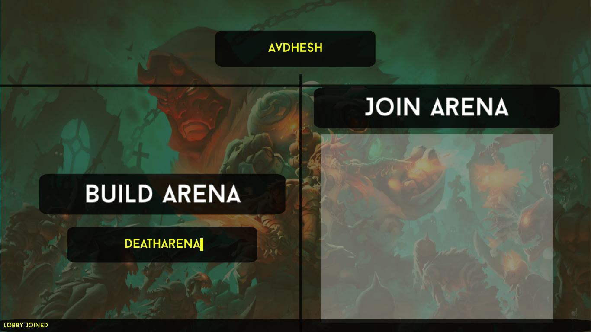
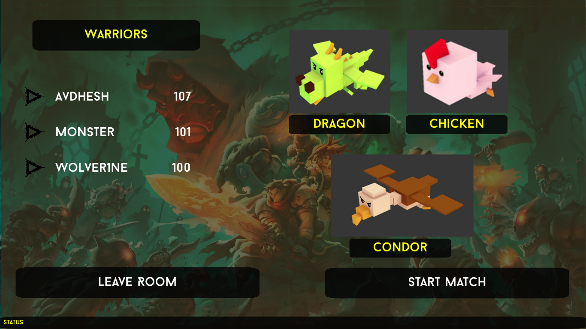
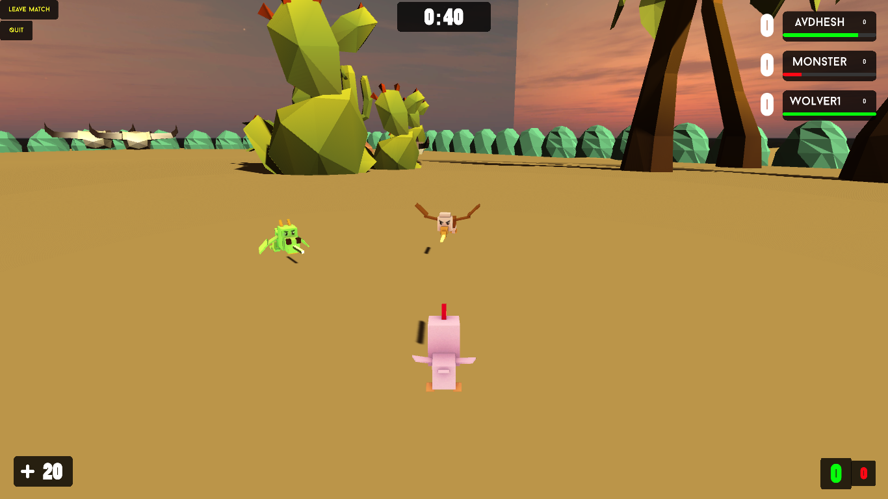
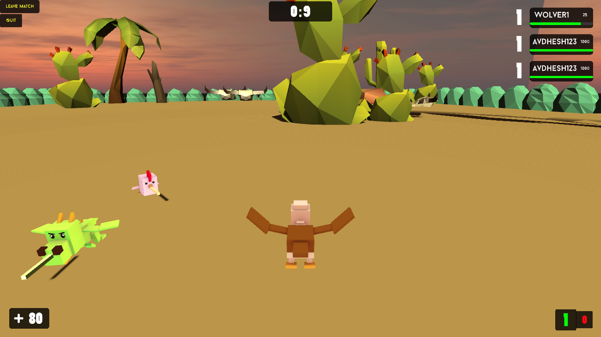
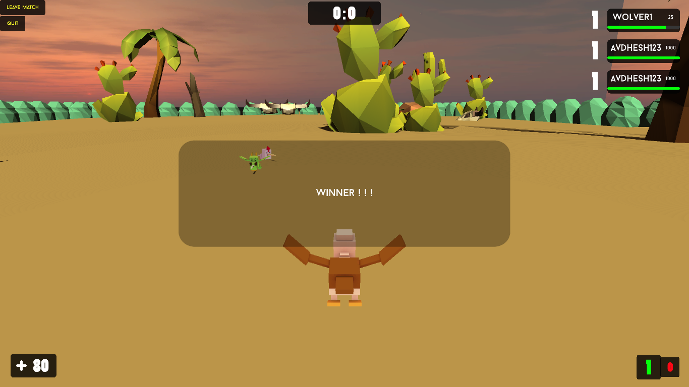

# BattleArena_CN

Networking project to understand and learn how different components work in Photon Unity Networking.

Just connect to the Internet, launch game, create room with a name and distribute it to your friends with whom you want to battle.

Max players allowed per room = 5

**Available on itch.io:** [BattleArena](https://avi-spc.itch.io/battlearena)

### Gained knowledge of

* PhotonViews
* RPCs
* Data Serialization across the network
* Animator and Transform views

### Tools used

* Blender3D
* Photon Unity Networking
* Untiy Game Engine

## Screenshots
**Start Screen**

**Lobby Screen**

**Game Screen**

**Score**

